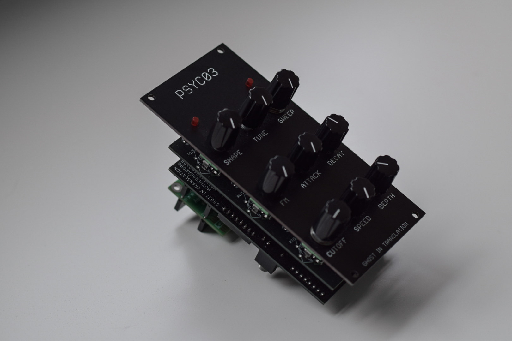

# PSYC03


PSYC03, alias PerCussive SYnth 03, is the result of the combination of a Syncussion and a TB303, an acid percussive synth.

It is based on [Motherboard](https://github.com/ghostintranslation/motherboard), my modular platform, see in there for schematics.

You can get the PCBs and front panel here:<br/>
https://ghostintranslation.bandcamp.com/merch/psyc03-panel-and-pcb

<p>
 
</p>

## Features

* Sine, Triangle, Square shapes
* Acid style filter 
* Filter with LFO
* FM
* MIDI over USB
* MIDI over mini jack
* Audio jack output
* Audio output over USB

## Dimensions

Height: 3U / 128.5mm

Width: 12HP / 60mm

## Getting Started

### Prerequisites

What things you need to make it work:

```
1 Teensy 4.0
1 Teensy audio board
1 MOTHERBOARD9A pcb
1 MOTHERBOARD9B pcb
1 PSYC03 front panel pcb
9 vertical linear 10k potentiometers with their nuts
1 5 pins male header
1 5 pins female headers
3 14 pins male header
5 14 pins female header
2 14 pins long female header
6 CD4051 multiplexers
6 DIP16 IC sockets (optional)
2 3.5mm jack connectors
1 resistor ~ 22ohm
2 LED
1 4 positions dipswitch (optional)
```

Here is a list of useful links to get these parts: https://github.com/ghostintranslation/parts

Note: 
- The resistor doesn't need to be high because the multiplexers already are resistive, so try a few values. You can place the resistor and LEDs without soldering to test, there should be enough contact.
- The dipswitch is optional, without it the module will listen to channel 1.

### Assembly

1. Solder male 14 pins headers on the audio board
2. Solder 14 pins long female header and 5 pins male header on Teensy
3. Solder 14 pins male headers on MOTHERBOARD9A
4. Place the potentiometers and LEDs on MOTHERBOARD9A, and attach the front panel
5. Solder the potentiometers and the LEDs
6. Place the 14 pins and 5 pins female headers for the Teensy on MOTHERBOARD9B, insert the Teensy on them, then solder the headers
7. Detach the Teensy for now
8. Solder the jack connectors, the dipswitch and the resistor on MOTHERBOARD9B
9. Place 14 pins female headers on MOTHERBOARD9B, connect MOTHERBOARD9A on them, then solder the headers
10. Detach the boards for now
11. Solder IC sockets on IC1, IC2, IC3, IC4, IC7 and IC8 positions on MOTHERBOARD9B
12. Add the multiplexers on the sockets, connect the 2 boards and connect the Teensy and audio board

Note: Be careful how you place the potentiometers:


### Firmware

In order to run any sketch on the Teensy you have to install Arduino and the Teensyduino add-on.
Follow the instructions from the official page:
https://www.pjrc.com/teensy/teensyduino.html

1. Then open `Psyc03.ino` located in the `Psyc03` folder of this repo.
2. In the Tools -> USB Type menu, choose `Serial + midi + audio`.
3. Plug the Teensy to your computer with a micro USB cable. (It's ok if the Teensy is on the module)
4. Then just click the arrow button to upload the code

## How to use

Here is a description of the 9 inputs and what they do:

```
1. Shape
    1. Sine
    2. Triangle
    3. Square
2. Tune
3. Sweep
4. FM
    - Modulator frequency and amplitude
5. Attack                    (0 to 2000ms)
6. Release                   (0 to 2000ms)
7. Cutoff
    - Low pass resonant filter
8. Speed
    - Frequency of the filter LFO
9. Depth
    - Amplitude of the filter LFO

```

All of the inputs are available via MIDI CC.

## MIDI

DSPSYC03 supports MIDI in via USB and TS jack. It doesn't send out any MIDI.

The default settings are:
```
CC 0 = Shape
CC 1 = Tune
CC 2 = Sweep
CC 3 = FM
CC 4 = Attack
CC 5 = Decay
CC 6 = Cutoff
CC 7 = Speed
CC 8 = Depth
```

These settings can be changed in the code or via the web editor: http://ghostintranslation.com/editor

**Important:**

The MIDI input and output jacks are directly connected to the Teensy serial input and output. That means there is not protection against voltage or current. It is primarily ment to connect 2 of these modules, or 2 Teensy together. If you want to connect something else to it make sure to provide a maximum of 3.3v and 250 mA.

## About me
You can find me on Bandcamp, Instagram, Youtube and my own site:

https://ghostintranslation.bandcamp.com/

https://www.instagram.com/ghostintranslation/

https://www.youtube.com/channel/UCcyUTGTM-hGLIz4194Inxyw

https://www.ghostintranslation.com/

## Support
To support my work:<br>
https://www.paypal.com/paypalme/ghostintranslation

## License

This project is licensed under the MIT License - see the [LICENSE.md](LICENSE.md) file for details